<p align="center">
  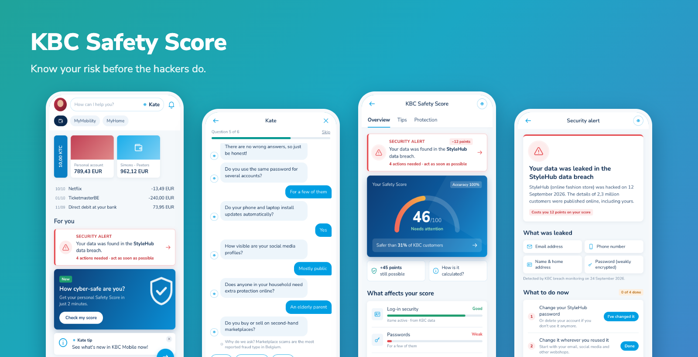
</p>

<h1 align="center">KBC Safety Score</h1>
<p align="center"><b>Know your risk before the hackers do.</b></p>
<p align="center">
  A hackathon prototype of a new KBC Mobile feature that shows customers how exposed they are to cybercrime,<br>
  helps them close the gaps, and offers protection that fits their situation.
</p>

<p align="center">
  <a href="#-try-it">Try it</a> ·
  <a href="#-the-proposal">The proposal</a> ·
  <a href="#-the-customer-journey">Customer journey</a> ·
  <a href="#-how-the-score-works">How the score works</a> ·
  <a href="#-run-it-locally">Run it locally</a>
</p>

---

## 🚀 Try it

The whole app is bundled into **one HTML file**, [`mockup/index.html`](mockup/index.html). Download it and open it in any browser, with no install or server needed. Resize the window to phone width, or open it on your phone.

> Use **Reset demo** at the bottom of the score page to start the journey over.

## 💡 The proposal

The **KBC Safety Score** is a new feature in the KBC app that shows customers how exposed they are to cybercrime.

**Customers choose what they share.** They talk to Kate, our AI assistant, who asks simple questions about their situation. They can also connect data sources they already use with KBC, like **Kate Coins** and **Bolero**. The more they share, the more accurate their score gets.

**Customers with a higher risk get personal tips that match their situation.** These reach them through every personal channel we have: e-mail, in-app notifications, messages from Kate and more.

- 👨‍👩‍👧 **Families with children** learn how to spot scams that target kids.
- 👵 **Older customers** (and their families) are warned about fake police officers at the door who try to steal their bank cards.
- 🚨 **Customers caught in a data breach** get an immediate alert, with the steps to take.

**KBC's cybersecurity products are woven into this series of tips.** We give value first, and only then offer a product that fits. A better score also means a lower insurance premium, so both KBC and the customer benefit when they stay safe.

### Why it matters

| For the customer | For KBC |
|---|---|
| Understands their real risk in 2 minutes | A new, relevant reason to open the app |
| Concrete, personal steps instead of generic warnings | Fewer fraud cases and lower fraud losses |
| Warned early when their data leaks | Cyber insurance sold at the moment of highest relevance |
| Rewarded with a lower premium for safe behaviour | Richer, consented customer insights |

### Next: Safety Score for businesses

The same concept scales to SMEs and corporates: a **Business Safety Score** built from their banking behaviour, their answers about employees, devices and payment processes, and connected data. The sales flow stays the same (score → tips → matching protection), with business cyber insurance at the end.

## 📱 The customer journey

### 1. Discover
The score is introduced in "For you" on the Start screen. When the customer's data turns up in a breach, a security alert appears here too.

<p>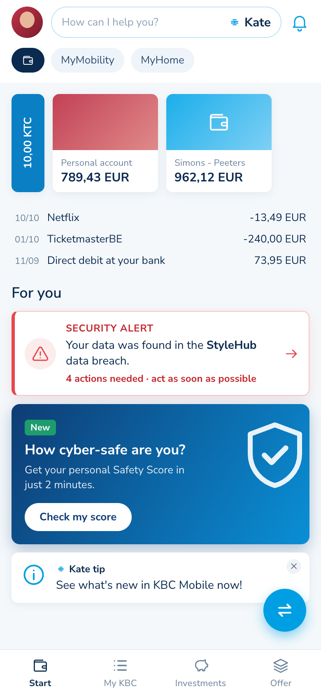</p>

### 2. Share what you want
We show what we already know from banking data, which answers are still missing, and which data sources can be connected. Every bit of extra data raises the score's **accuracy**.

<p>
  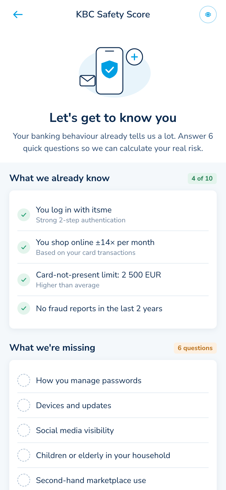
  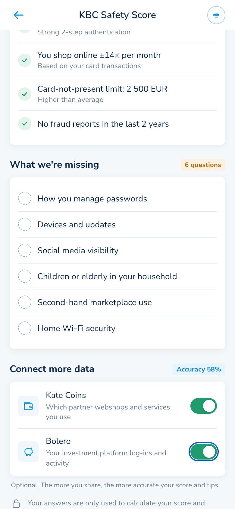
</p>

### 3. Chat with Kate
Kate asks the missing questions one at a time, in her familiar chat style, and explains why each one matters.

<p>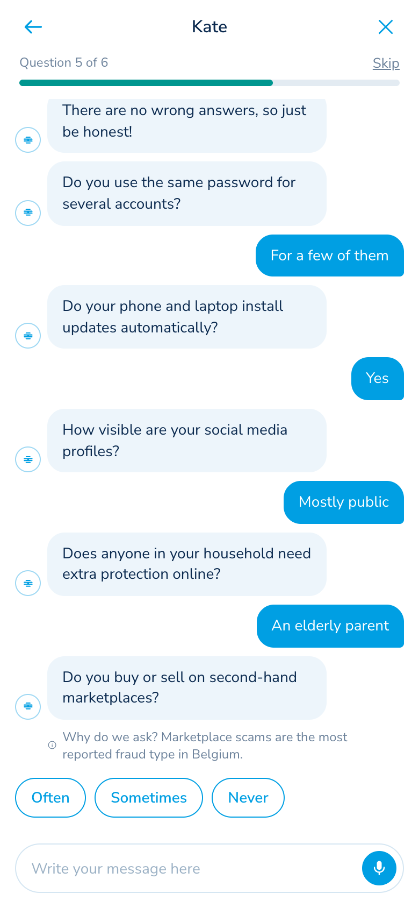</p>

### 4. See your score, improve it
The dashboard shows the score, how it compares with other KBC customers, and what drives it. Tips are ranked by impact, and articles match the customer's situation. For example, the fake-police warning appears for a household with an elderly parent.

<p>
  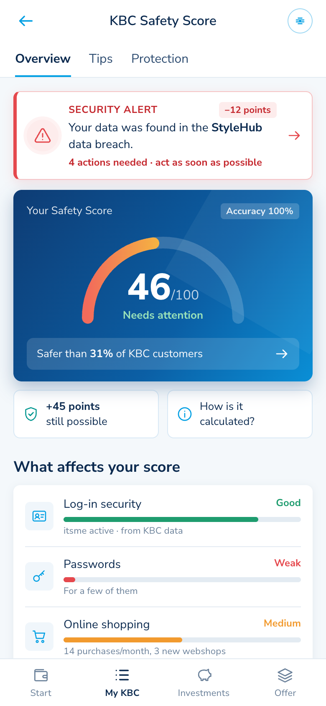
  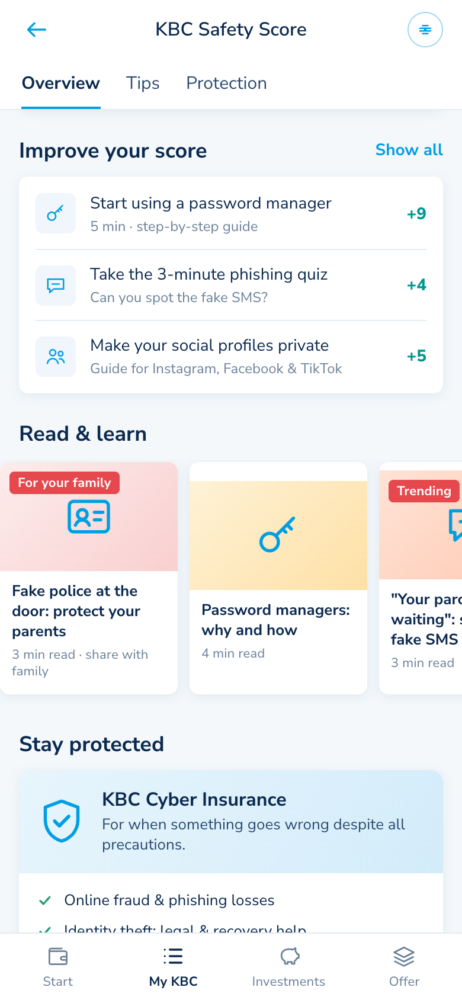
  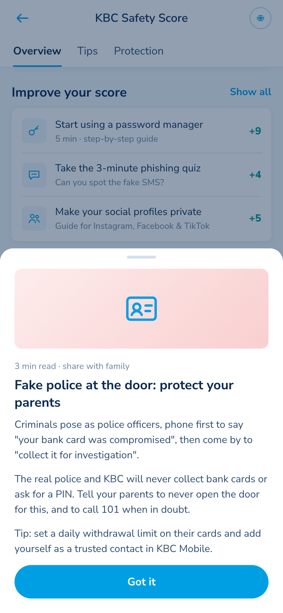
</p>

### 5. Act on data breaches
When the customer's data is found in a breach, the alert lowers their score until they take action. A checklist guides them through it, and then points them to cover for the risk that remains.

<p>
  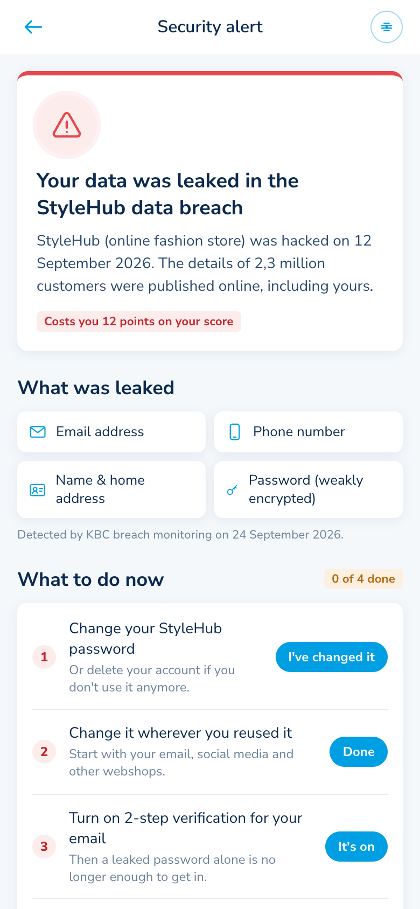
  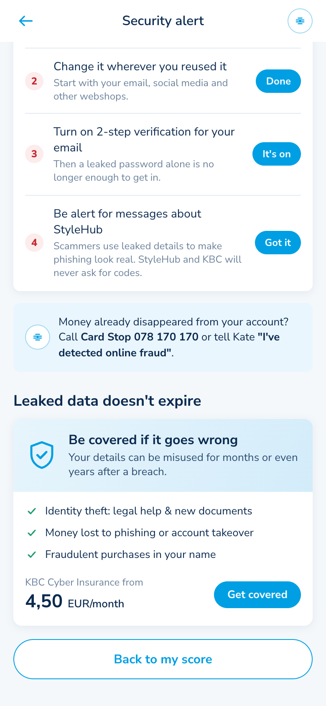
</p>

### 6. Get protected
KBC Cyber Insurance is recommended based on the customer's profile, with the Family plan suggested when there are dependants. The premium drops as the score rises, and **Kate Coins are only rewarded on purchase**.

<p>
  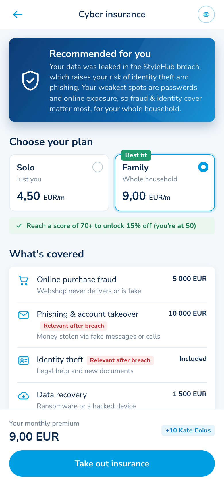
  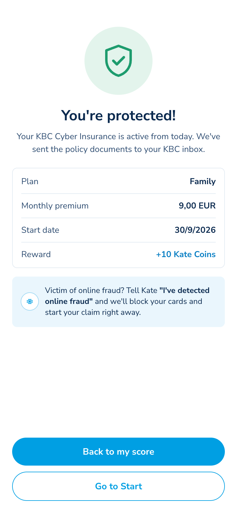
</p>

## 🧮 How the score works

The score (0–100) is the average of five factors, each based on KBC data, the customer's answers and connected sources:

| Factor | Based on |
|---|---|
| Log-in security | itsme usage (KBC data) |
| Passwords | Password reuse (Kate question) |
| Online shopping | Card-not-present transactions, marketplace use |
| Online exposure | Social media visibility, vulnerable household members |
| Devices & network | Automatic updates, home Wi-Fi |

- **Tips** raise the factor they relate to. The points shown are the real effect on the score.
- **An unresolved data breach** lowers the score, and each completed step gives points back.
- **Insurance discount:** 15% from a score of 70, 25% from 80.

All rules, questions, tips, articles and prices live in [`src/data.ts`](src/data.ts), so they can be tuned without touching the screens.

> ⚠️ Prototype: all customer data, the "StyleHub" breach, prices and coverage amounts are fictional.

## 🛠 Run it locally

Requires Node 20+.

```bash
npm install
npm run dev              # dev server at http://localhost:5173
npm run dev -- --host    # also reachable from your phone on the same Wi-Fi
```

| Command | What it does |
|---|---|
| `npm run build` | Production PWA in `dist/` (service worker, manifest, offline support) |
| `npm run preview` | Serves `dist/` locally |
| `npm run build:mockup` | Bundles the app into a single file, `mockup/index.html` |
| `npm run screenshots` | Regenerates `docs/screenshots/` from the mockup (needs Chrome; set `CHROME_PATH` if it isn't in the default macOS location) |
| `npm run lint` | Lints with oxlint |

**Install as an app:** deploy `dist/` to any static HTTPS host (Netlify, Vercel, GitHub Pages), open it on a phone, and choose *Add to Home Screen*. It uses hash-based routes, so no server rewrites are needed.

### Tech stack

- **Vite + React 19 + TypeScript**: fast to build and iterate on
- **vite-plugin-pwa (Workbox)**: manifest, service worker, offline cache
- **vite-plugin-singlefile**: single-file HTML mockup
- **React Router** (hash routing): works on any static host and from `file://`
- **Plain CSS** with design tokens matching the KBC Mobile look. No UI framework.
- **localStorage**: remembers the demo's progress (answers, tips, breach steps, policy) between visits

### Project structure

```
├── mockup/index.html        single-file build of the app (open directly)
├── docs/screenshots/        README screenshots (npm run screenshots)
├── public/                  PWA icons and favicon
├── scripts/screenshots.mjs  walks through the journey in headless Chrome
└── src/
    ├── data.ts              scoring model, questions, tips, articles, breach, pricing
    ├── state.tsx            customer profile store (persisted to localStorage)
    ├── components/          shared UI, breach alert, icon sprite
    └── screens/             Home, Intro, Questions, Score, Breach, Insurance, Done
```

---

<p align="center"><i>Built for the KBC hackathon · Know your risk before the hackers do.</i></p>
